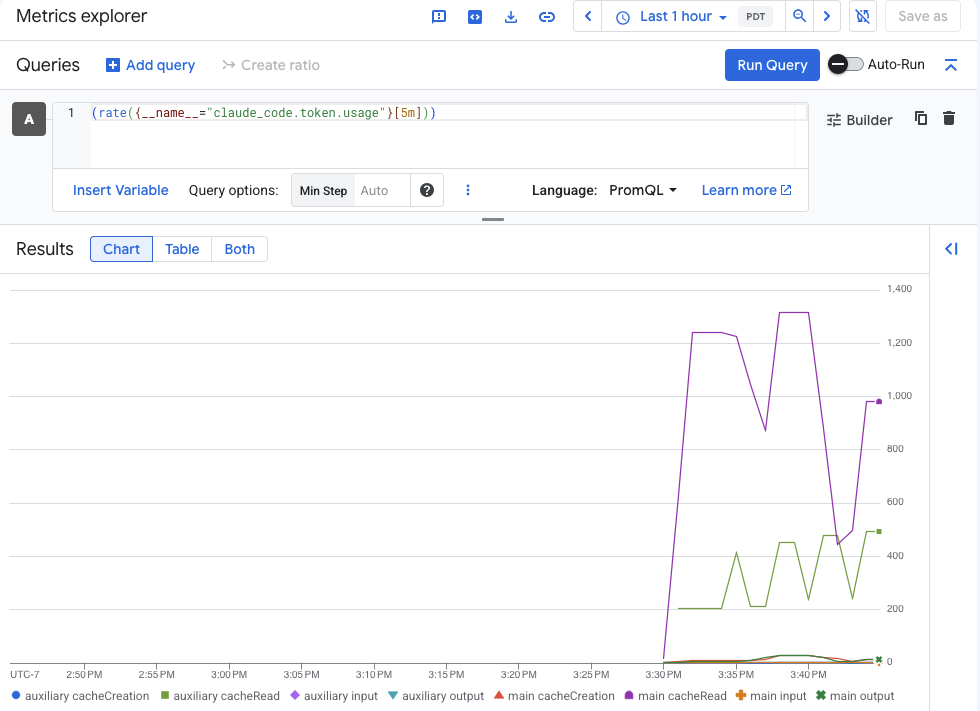
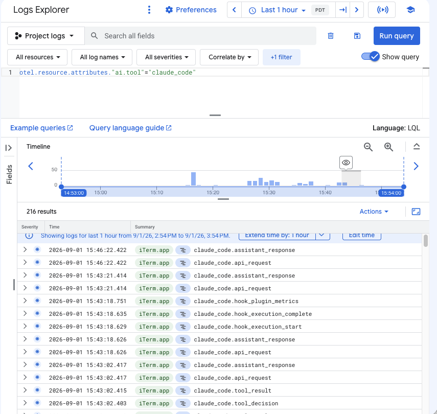
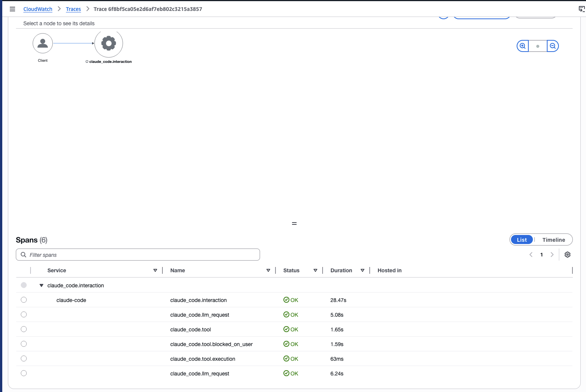
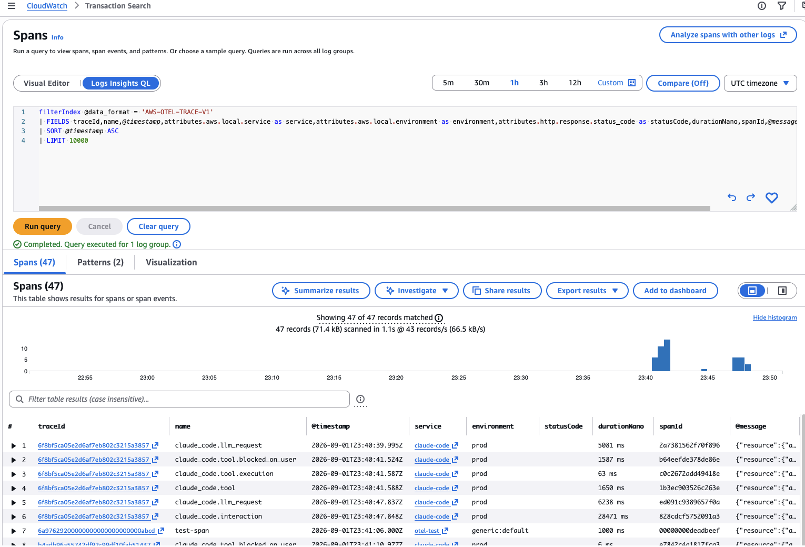
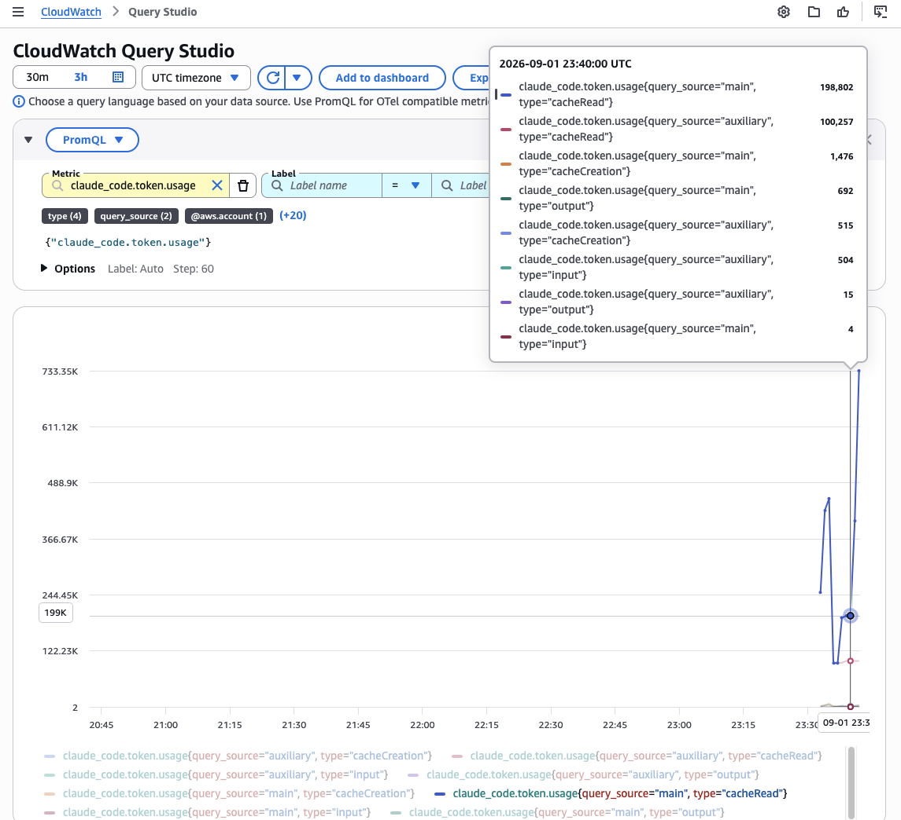

# Zero to Hero: AI Open telemetry gateway

A POC of a local OpenTelemetry (OTEL) Collector that accepts telemetry from Claude Code,
Codex CLI and Gemini CLI, redacts secrets, trims metric cardinality, and
ships to AWS CloudWatch or Google Cloud Observability.

Validated against `otelcol-contrib` v0.140.1 and v0.159.0.

## Architecture

The OpenTelemetry Collector contrib distribution captures OTEL from local AI Agents. Run it on laptops using AI agents or on a shared host, point every AI tool at it, and export once to your cloud.

```
Claude Code ──grpc 4317 / http 4318 ─┐
Codex CLI   ──grpc 4417 / http 4418 ─┼──► otelcol-contrib ──► AWS or GCP 
Gemini CLI  ──grpc 4517 / http 4518 ─┘
```

Each tool gets its own port. The gateway stamps `ai.tool` based on the port, so you can query all three together without guessing at event name prefixes or scope names.

## Install

Install from the release tarball, or the container image.

We purposefully use the contrib build for native cloud authentication. The core build (`otelcol`, no `-contrib`) does not include `sigv4auth`, `googleclientauth`, `redaction` or `awss3` options. Using the contrib build we can reuse native AWS or GCP authentication without harcoding api keys or headers in the config.

Note the binary name. The download is `otelcol-contrib_<version>_<os>_<arch>.tar.gz`
and the binary inside is `otelcol-contrib`.

**macOS, Apple Silicon:**

```bash
V=0.159.0
curl --proto '=https' --tlsv1.2 -fOL \
  "https://github.com/open-telemetry/opentelemetry-collector-releases/releases/download/v${V}/otelcol-contrib_${V}_darwin_arm64.tar.gz"
tar -xzf "otelcol-contrib_${V}_darwin_arm64.tar.gz" otelcol-contrib
sudo mv otelcol-contrib /usr/local/bin/
xattr -d com.apple.quarantine /usr/local/bin/otelcol-contrib 2>/dev/null || true
```

**macOS, Intel:** same commands with `darwin_amd64`.

**Linux:** use `darwin` to `linux` in the same URL, or install the
`.deb` or `.rpm` from the same release page.

**Container:** `otel/opentelemetry-collector-contrib` on Docker Hub, or
`ghcr.io/open-telemetry/opentelemetry-collector-releases/opentelemetry-collector-contrib`.

```bash
docker run --rm -p 4317:4317 -p 4318:4318 -p 4417:4417 -p 4418:4418 \
  -p 4517:4517 -p 4518:4518 \
  -v "$PWD/otel-ai-gateway.aws.yaml:/etc/otel/config.yaml" \
  -e AWS_REGION -e AI_TELEMETRY_ENV -e AI_TELEMETRY_TENANT \
  -e AI_TELEMETRY_ARCHIVE_BUCKET \
  -v "$HOME/.aws:/home/nonroot/.aws:ro" \
  otel/opentelemetry-collector-contrib --config /etc/otel/config.yaml
```

If you run in a container, change every receiver `endpoint` in the config
from `127.0.0.1` to `0.0.0.0`. The loopback bind is deliberate for a host
install, because it keeps the gateway off the network. A container needs
to accept traffic on its published ports.


## Run: AWS

Alter the variables to suit your environment
```bash
export AWS_REGION=us-west-2
export AI_TELEMETRY_ENV=prod
export AI_TELEMETRY_TENANT=acme-corp

aws logs create-log-group --log-group-name /ai/agent-telemetry

otelcol-contrib --config otel-ai-gateway.aws.yaml
```

Endpoints used:

| Signal | Endpoint | SigV4 service |
|---|---|---|
| Metrics | `https://monitoring.<region>.amazonaws.com/v1/metrics` | `monitoring` |
| Logs | `https://logs.<region>.amazonaws.com/v1/logs` | `logs` |
| Traces | `https://xray.<region>.amazonaws.com/v1/traces` | `xray` |

The logs endpoint takes the destination from the `x-aws-log-group` and
`x-aws-log-stream` headers, which the config sets per tool.

IAM for the collector identity:

```json
{
  "Version": "2012-10-17",
  "Statement": [
    { "Effect": "Allow",
      "Action": ["logs:PutLogEvents", "logs:CreateLogStream", "logs:CreateLogGroup"],
      "Resource": "arn:aws:logs:*:*:log-group:/ai/agent-telemetry:*" },
    { "Effect": "Allow", "Action": ["cloudwatch:PutMetricData"], "Resource": "*" },
    { "Effect": "Allow", "Action": ["xray:PutTraceSegments"], "Resource": "*" },
    { "Effect": "Allow", "Action": ["s3:PutObject"],
      "Resource": "arn:aws:s3:::acme-ai-telemetry-archive/*" }
  ]
}
```

CloudWatch OTLP is HTTP only. The gateway still accepts gRPC from the
clients and converts on the way out.

## Run: GCP

```bash
export GOOGLE_CLOUD_PROJECT=acme-observability
export AI_TELEMETRY_ENV=prod
export AI_TELEMETRY_TENANT=acme-corp

gcloud auth application-default login   # or attach a service account

otelcol-contrib --config otel-ai-gateway.gcp.yaml
```

One endpoint takes all three signals: `https://telemetry.googleapis.com`.
It routes to `/v1/traces`, `/v1/metrics` or `/v1/logs` by data type.

Grant the collector identity:

- `roles/telemetry.writer`
- `roles/serviceusage.serviceUsageConsumer`

The `gcp.project_id` resource attribute is required. The
`resource/gcp_project_id` processor sets it.

For raw archive on GCP, create a Cloud Logging sink to a GCS bucket
rather than adding a collector exporter.

## Point the tools at it

Copy the files in `clients/` to enable your local AI platform to pick up the OTEL config:

| Tool | File | Destination |
|---|---|---|
| Claude Code | claude-code-managed-settings.json, or `source clients/claude_otel.sh` | Claude Enterprise Console managed settings
| Codex CLI | `codex-config.toml` | `~/.codex/config.toml` |
| Gemini CLI | `gemini-cli-settings.json` | `~/.gemini/settings.json` |

Use Claude Code managed settings in production. Managed settings lock the
endpoint and headers, and remove conflicting per-signal variables that a
developer might set.

## Gateway Operations

- **Stamps `ai.tool`** per receiver port, so one query covers all tools.
- **Adds tenant and environment** as resource attributes.
- **Redacts secret patterns** in bodies and attributes: Anthropic and
  OpenAI keys, AWS access keys, GitHub tokens, Slack tokens, JWTs, PEM
  private key headers, and email addresses. Matches become `****`.
- **Drops raw API bodies** (`claude_code.api_request_body` and
  `api_response_body`) before anything leaves the host.
- **Trims metric cardinality** by deleting `session.id` and
  `terminal.type` and hashing the identity attributes. Identity stays
  intact on log events, where you actually need attribution.

## Verify

```bash
otelcol-contrib validate --config otel-ai-gateway.aws.yaml
curl -s http://127.0.0.1:13133   # health check
```

Then run `claude` once and confirm `claude_code.session.count` appears in
AWS CloudWatch or Google Cloud Monitoring, and that a `claude_code.user_prompt`
event appears in the log group.

## Two-tier option

For a company rather than one laptop, run this config twice:

1. **Agent tier** on each laptop, exporting `otlp` to the gateway instead
   of to the cloud. No cloud credentials on endpoints.
2. **Gateway tier** in the VPC, holding the cloud credentials and doing
   the redaction.

If laptops must reach the cloud directly, CloudWatch bearer token auth
works for logs and metrics without IAM credentials. It does not work for
traces.

## Content flags 

Choose whether or not to log prompts based on your data classification decision. 

`OTEL_LOG_USER_PROMPTS`, `OTEL_LOG_ASSISTANT_RESPONSES`,
`OTEL_LOG_TOOL_CONTENT` and `OTEL_LOG_RAW_API_BODIES` will log raw prompts and result in source code and
prompt text residing in your log store. The configs here leave them off and set
`log_user_prompt = false` and `logPrompts: false` on the other two tools.
Turn them on only after you decide where that data may live and how long
you keep it.

The gateway itself becomes a high-value target once it holds an ingest
credential and a stream of prompts. Give it its own identity, restrict
egress to the ingest endpoints, and monitor its own health endpoint.

## Production OTEL options
This is meant as a POC rather than a production blueprint. The OTEL project has a extensive list of configuration options for various OTEL production configurations here: https://opentelemetry.io/ecosystem/vendors/


## Query notes
Anthropic on how to reconstruct a user session: 
https://support.claude.com/en/articles/14447276-configure-a-custom-opentelemetry-collector-for-office-agents#h_f2c9f8763d


## Screenshots
GCP Metrics Explorer
https://console.cloud.google.com/monitoring/metrics-explorer



GCP Log Explorer
https://console.cloud.google.com/logs/query



AWS Cloudwatch trace


AWS Cloudwatch transaction


AWS Cloudwatch query studio
